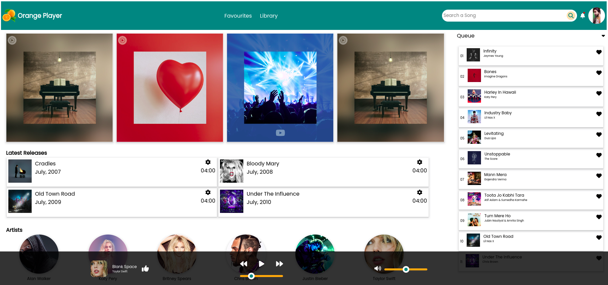
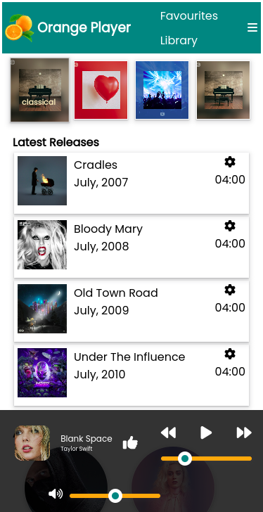

# Orange PLayer [Responsive Music Player]

Its a static website with some dynamic features only.
This project aims to design and structure the basic front end skills.

## What's inside?

- Latest songs section is working as I do not own the songs.
- Just used some files for education purposes.
- Latest Songs section is playable.
- Play, pause, forward and backward works fine.
- volume and timestamp sldier works.

## Screenshots

## Authors

- [@ujjawalbiswas](https://www.linkedin.com/in/ujjawal-biswas-b40611142/)

## License

[MIT](https://choosealicense.com/licenses/mit/)
